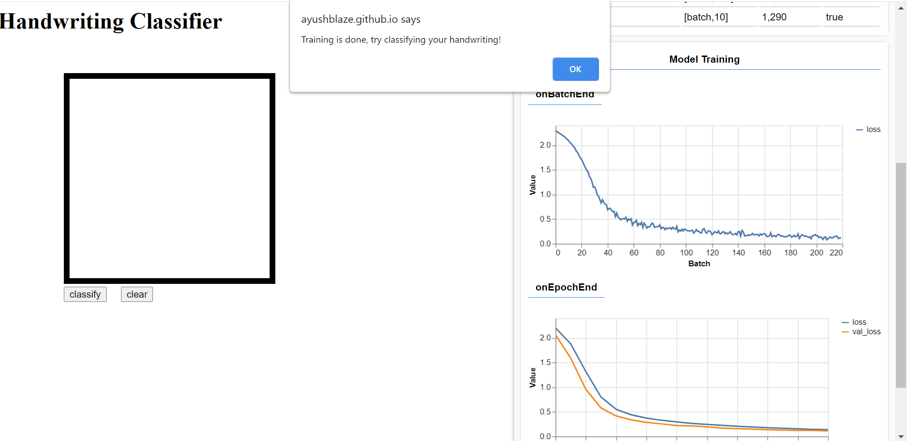
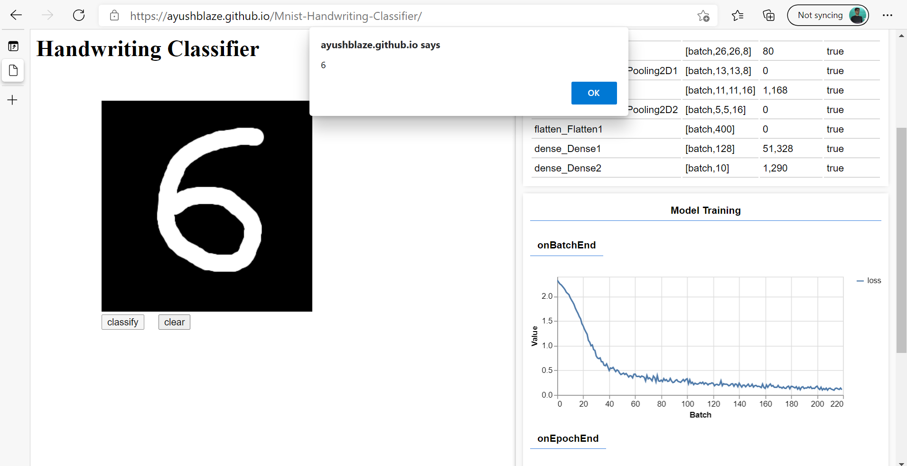

# Mnist-Handwriting-Classifier
https://ayushblaze.github.io/Mnist-Handwriting-Classifier/  
This is a Handwriting Classifier made using Tensorflow.js and is trained on Mnist dataset,  the training data was in the form of a [Spritesheet](https://en.wikipedia.org/wiki/Texture_atlas#:~:text=In%20computer%20graphics%2C%20a%20texture,together%20to%20reduce%20overall%20dimensions.&text=A%20sub%2Dimage%20is%20drawn,it%20out%20of%20the%20atlas.) also know as a [Texture atlas.](https://en.wikipedia.org/wiki/Texture_atlas#:~:text=In%20computer%20graphics%2C%20a%20texture,together%20to%20reduce%20overall%20dimensions.&text=A%20sub%2Dimage%20is%20drawn,it%20out%20of%20the%20atlas.) 
Link to [Spritesheet](https://storage.googleapis.com/learnjs-data/model-builder/mnist_images.png)
 
 
 

